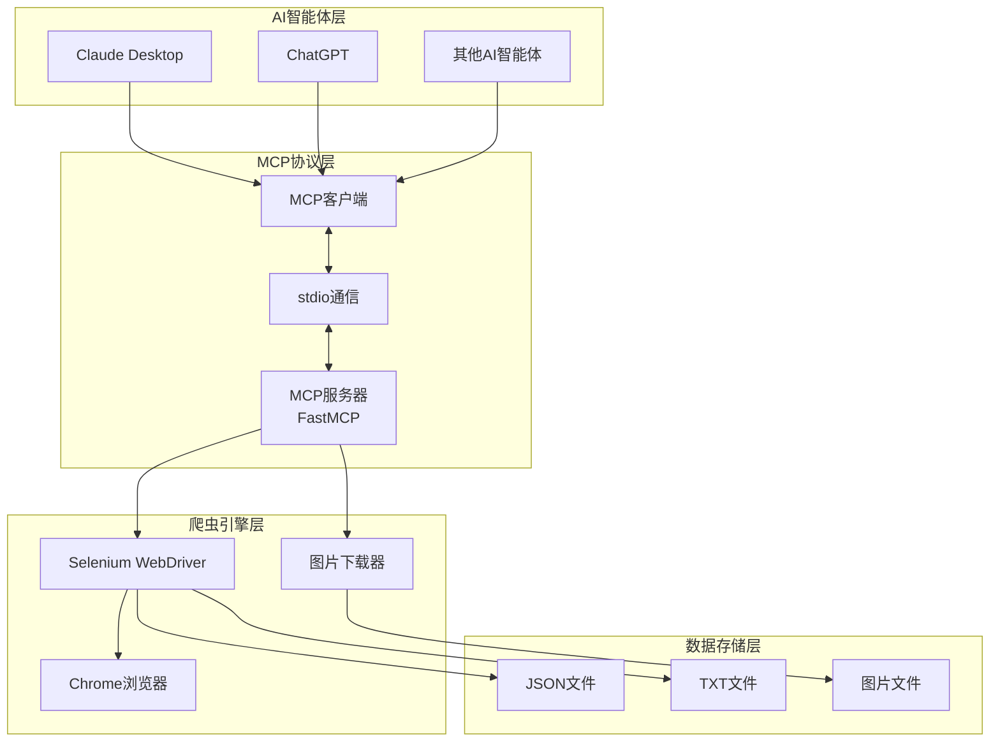

# MCP微信公众号爬虫

[](https://python.org)
[](https://github.com/modelcontextprotocol)
[](https://github.com/jlowin/fastmcp)
[](LICENSE)

基于 **FastMCP** 框架构建的微信公众号文章爬虫系统，让AI智能体能够直接访问和分析微信公众号内容。通过MCP (Model Context Protocol) 标准协议，实现AI智能体与Selenium爬虫的无缝集成。

## 🎯 项目背景

在使用AI平台或智能体时，我们发现智能体无法直接访问微信公众号文章内容。为了解决这个问题，我们开发了这个基于MCP协议的爬虫服务，让AI智能体能够获取和分析微信公众号的内容。

## ✨ 核心特性

- 🤖 **FastMCP框架** - 基于FastMCP高级封装，简化MCP服务器开发
- 🕷️ **智能爬虫** - 使用Selenium自动化浏览器，支持动态内容抓取
- 🖼️ **图片处理** - 自动下载文章图片并转换为本地文件
- 📊 **内容分析** - 提供文章统计、关键词提取等分析功能
- 🔌 **标准协议** - 完全兼容MCP 1.0+规范，支持stdio通信
- 🎯 **AI集成** - 可与Claude Desktop、ChatGPT等AI智能体无缝集成
- 💻 **多种接口** - 提供Python API和交互式命令行界面

## 🏗️ 系统架构



### 🔧 核心组件

#### 1. FastMCP服务器 (`server.py`)
- 基于FastMCP框架的高级封装
- 提供3个核心工具：文章爬取、内容分析、统计信息
- 单例模式管理Selenium爬虫实例
- 完整的错误处理和参数验证

#### 2. MCP标准客户端 (`client.py`)
- 标准MCP协议客户端实现
- 异步通信和会话管理
- 交互式命令行界面
- Python API接口

#### 3. Selenium爬虫引擎 (`weixin_spider_simple.py`)
- Chrome浏览器自动化控制
- 反爬虫机制处理
- 图片下载和格式转换
- 多格式文件保存

## 🚀 快速开始

### 📋 环境要求

- **Python**: 3.8+ (推荐 3.10+)
- **浏览器**: Chrome/Chromium (自动管理ChromeDriver)
- **系统**: macOS/Windows/Linux

### 📦 安装步骤

```bash
# 1. 克隆项目
git clone <repository-url>
cd mcp-weixin

# 2. 安装依赖
pip install -r requirements.txt
```

### 🎮 启动方式

#### 模块化启动（推荐）

```bash
# 启动MCP服务器
python -m mcp_weixin_spider

# 启动客户端演示
python -m mcp_weixin_spider.client
```


## 🛠️ MCP工具接口

```yaml
{
  "mcpServers": {
    "weixin_spider": {
      "command": "python",
      "args": [
        "本地路径/server.py"
      ],
      "env": {
        "ARTICLES_DIR": "articles",
        "DOWNLOAD_IMAGES": "true",
        "HEADLESS": "true",
        "WAIT_TIME": "10"
      }
    }
  }
}
```