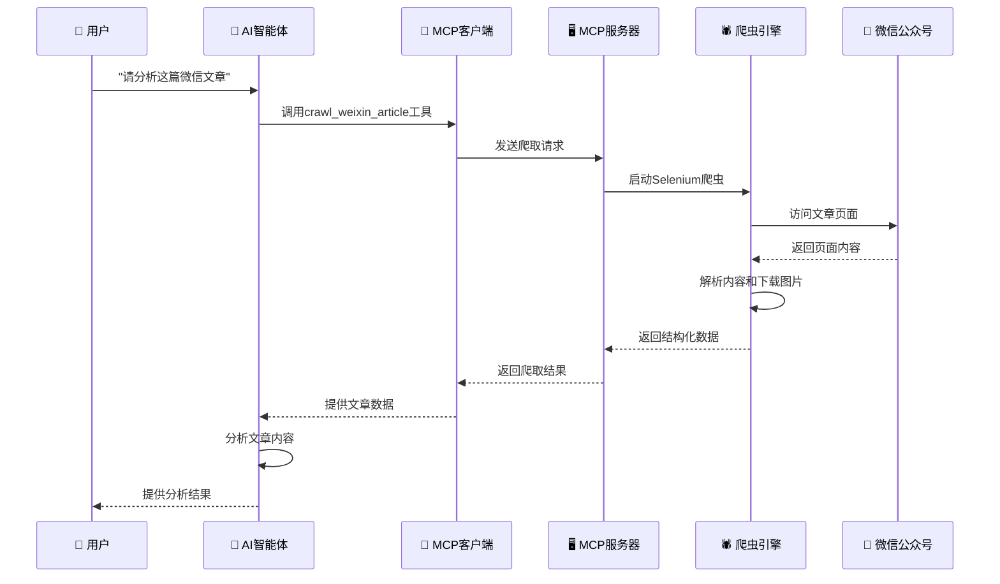

# MCP微信公众号文章爬虫

[](https://python.org)
[](https://github.com/modelcontextprotocol)
[](LICENSE)

基于MCP (Model Context Protocol) 架构的微信公众号文章爬虫系统，实现AI智能体与Selenium爬虫的无缝集成。支持文章内容抓取、图片下载、内容分析等功能。

## ✨ 主要特性

- 🤖 **MCP标准协议** - 完全兼容MCP 1.0+规范
- 🕷️ **智能爬虫** - 基于Selenium的微信文章爬取
- 🖼️ **图片下载** - 自动下载并转换文章图片
- 📊 **内容分析** - 提供文章统计和分析功能
- 🔧 **多种启动方式** - 支持模块化、脚本化等多种启动方式
- 📱 **智能体集成** - 可与Claude、ChatGPT等AI智能体无缝集成
- 🛠️ **开发友好** - 提供完整的API和交互式界面

## 🏗️ 架构设计


### 核心组件

1. **MCP服务器** (`server.py`)
   - 🔌 提供标准化的MCP工具和资源接口
   - 🎯 管理Selenium爬虫实例（单例模式）
   - 📝 处理文章爬取、分析和统计请求
   - 🛡️ 参数验证和错误处理

2. **MCP客户端** (`client.py`)
   - 🔗 与MCP服务器异步通信
   - 🐍 提供Python API接口
   - 💬 支持交互式命令行界面
   - 📋 资源和工具管理

3. **Selenium爬虫** (`weixin_spider_simple.py`)
   - 🌐 实际的网页抓取逻辑
   - 🖼️ 图片下载和格式转换
   - 💾 多格式文件保存（JSON、TXT）
   - 🔄 反爬虫机制处理

## 🚀 快速开始

### 📋 环境要求

- **Python**: 3.8+ (推荐3.10+)
- **浏览器**: Chrome/Chromium (自动管理ChromeDriver)
- **系统**: Windows/macOS/Linux

### 📦 安装方式

#### 方式1: 开发安装（推荐）

```bash
# 克隆项目
git clone <repository-url>
cd MCPWeiXin

# 安装依赖
pip install -r requirements.txt

# 开发模式安装
pip install -e .
```

#### 方式2: 直接安装

```bash
# 进入项目目录
cd MCPWeiXin

# 安装项目
pip install .
```

### 🚀 启动方式

#### 1. 模块化启动（推荐）

```bash
# 启动MCP服务器（默认）
python -m mcp_weixin_spider

# 明确启动服务器
python -m mcp_weixin_spider.server

# 启动客户端演示
python -m mcp_weixin_spider.client

# 交互式客户端
python -m mcp_weixin_spider --interactive
```

#### 2. 脚本启动

```bash
# 使用main.py启动
python src/mcp_weixin_spider/main.py server
python src/mcp_weixin_spider/main.py client

# 直接运行服务器
python src/mcp_weixin_spider/server.py
```

#### 3. 命令行工具（安装后）

```bash
# 启动服务器
mcp-weixin-spider

# 启动服务器（明确）
mcp-weixin-spider-server

# 启动客户端
mcp-weixin-spider-client
```

#### 4. 调试模式

```bash
# 服务器调试模式
python -m mcp_weixin_spider.server --debug

# 客户端调试模式
python -m mcp_weixin_spider.client --debug
```

## 🔧 MCP工具接口

### 🛠️ 可用工具

| 工具名称 | 功能描述 | 参数 | 返回值 |
|---------|---------|------|--------|
| **crawl_weixin_article** | 爬取指定URL的微信文章 | `url` (string) - 微信文章URL | 文章内容、图片信息、保存路径等 |
| **get_recent_articles** | 获取最近爬取的文章列表 | `limit` (number, 可选) - 返回数量限制 | 最近爬取的文章信息列表 |
| **get_spider_config** | 获取爬虫当前配置 | 无 | 爬虫配置信息 |
| **analyze_article_stats** | 分析文章统计信息 | `article_path` (string) - 文章文件路径 | 文章统计分析结果 |

#### 工具详细说明

**1. crawl_weixin_article**
```json
{
  "name": "crawl_weixin_article",
  "description": "爬取微信公众号文章内容和图片",
  "inputSchema": {
    "type": "object",
    "properties": {
      "url": {
        "type": "string",
        "description": "微信文章的完整URL"
      }
    },
    "required": ["url"]
  }
}
```

**2. get_recent_articles**
```json
{
  "name": "get_recent_articles",
  "description": "获取最近爬取的文章列表",
  "inputSchema": {
    "type": "object",
    "properties": {
      "limit": {
        "type": "number",
        "description": "返回文章数量限制",
        "default": 10
      }
    }
  }
}
```

### 📚 可用资源

| 资源名称 | 类型 | 描述 | 内容 |
|---------|------|------|------|
| **recent_articles** | JSON数据 | 最近爬取的文章列表 | 文章标题、URL、爬取时间等 |
| **spider_config** | JSON配置 | 当前爬虫配置信息 | 下载设置、路径配置等 |

#### 资源详细说明

**1. recent_articles**
- **URI**: `recent://articles`
- **MIME类型**: `application/json`
- **描述**: 提供最近爬取的文章信息
- **内容示例**:
```json
{
  "articles": [
    {
      "title": "文章标题",
      "url": "https://mp.weixin.qq.com/s/...",
      "crawl_time": "2024-12-20T10:30:00Z",
      "file_path": "/path/to/article.json"
    }
  ]
}
```

**2. spider_config**
- **URI**: `config://spider`
- **MIME类型**: `application/json`
- **描述**: 当前爬虫配置信息
- **内容示例**:
```json
{
  "download_images": true,
  "save_formats": ["json", "txt"],
  "output_dir": "./articles",
  "timeout": 30
}
```

## 💻 使用示例

### 🐍 Python API使用

#### 基础使用

```python
import asyncio
from mcp_weixin_spider.client import MCPWeixinClient

async def main():
    # 创建客户端
    client = MCPWeixinClient()
    
    try:
        # 连接到MCP服务器
        await client.connect()
        
        # 爬取文章
        result = await client.crawl_article(
            "https://mp.weixin.qq.com/s/example"
        )
        
        print(f"✅ 爬取成功: {result['article']['title']}")
        print(f"📄 内容长度: {result['article']['content_length']}")
        print(f"🖼️ 图片数量: {result['article']['images_count']}")
        
        # 获取最近文章
        recent = await client.get_recent_articles(limit=5)
        print(f"📚 最近文章数量: {len(recent['articles'])}")
        
        # 获取爬虫配置
        config = await client.get_spider_config()
        print(f"⚙️ 当前配置: {config}")
        
    except Exception as e:
        print(f"❌ 错误: {e}")
    finally:
        await client.disconnect()

if __name__ == "__main__":
    asyncio.run(main())
```

#### 批量处理示例

```python
import asyncio
from mcp_weixin_spider.client import MCPWeixinClient

async def batch_crawl():
    """批量爬取多篇文章"""
    urls = [
        "https://mp.weixin.qq.com/s/example1",
        "https://mp.weixin.qq.com/s/example2",
        "https://mp.weixin.qq.com/s/example3"
    ]
    
    client = MCPWeixinClient()
    
    try:
        await client.connect()
        
        results = []
        for i, url in enumerate(urls, 1):
            print(f"🕷️ 正在爬取第 {i}/{len(urls)} 篇文章...")
            try:
                result = await client.crawl_article(url)
                results.append(result)
                print(f"✅ 完成: {result['article']['title']}")
            except Exception as e:
                print(f"❌ 失败: {url} - {e}")
            
            # 避免请求过于频繁
            await asyncio.sleep(2)
        
        print(f"\n📊 批量爬取完成，成功 {len(results)}/{len(urls)} 篇")
        
    finally:
        await client.disconnect()

if __name__ == "__main__":
    asyncio.run(batch_crawl())
```

### 💬 交互式使用

启动交互式客户端：

```bash
python -m mcp_weixin_spider.client
```

交互界面示例：

```
🕷️ MCP微信爬虫客户端 v0.1.0
输入 'help' 查看可用命令，输入 'quit' 退出
✅ 已连接到MCP服务器

> help
📖 可用命令：
  help              - 显示此帮助信息
  tools             - 列出可用工具
  resources         - 列出可用资源
  crawl <url>       - 爬取指定URL的微信文章
  recent [limit]    - 显示最近爬取的文章
  config            - 显示爬虫配置
  stats <path>      - 分析文章统计信息
  clear             - 清屏
  quit/exit/q       - 退出客户端

> crawl https://mp.weixin.qq.com/s/example
🕷️ 开始爬取: https://mp.weixin.qq.com/s/example
⏳ 正在处理，请稍候...

📄 爬取结果：
{
  "status": "success",
  "message": "文章爬取成功",
  "article": {
    "title": "AI技术发展趋势分析",
    "author": "科技前沿",
    "publish_time": "2024-12-20",
    "content_length": 2500,
    "images_count": 8,
    "images_downloaded": "8/8",
    "save_path": "./articles/AI技术发展趋势分析_20241220.json"
  }
}

> recent 3
📚 最近爬取的文章 (3篇):
1. AI技术发展趋势分析 - 2024-12-20 10:30:00
2. 机器学习实战指南 - 2024-12-19 15:45:00
3. Python编程技巧分享 - 2024-12-18 09:20:00

> config
⚙️ 当前爬虫配置:
{
  "download_images": true,
  "save_formats": ["json", "txt"],
  "output_dir": "./articles",
  "timeout": 30,
  "user_agent": "Mozilla/5.0..."
}
```

## 🤖 与AI智能体集成

### 🎯 Claude Desktop配置

#### 方式1: 使用模块化启动（推荐）

在Claude Desktop的配置文件 `claude_desktop_config.json` 中添加：

```json
{
  "mcpServers": {
    "weixin-spider": {
      "command": "python",
      "args": [
        "-m",
        "mcp_weixin_spider.server"
      ],
      "cwd": "/path/to/MCPWeiXin",
      "env": {
        "PYTHONPATH": "/path/to/MCPWeiXin/src"
      }
    }
  }
}
```

#### 方式2: 使用安装后的命令行工具

```json
{
  "mcpServers": {
    "weixin-spider": {
      "command": "mcp-weixin-spider-server",
      "cwd": "/path/to/working/directory"
    }
  }
}
```

#### 方式3: 直接运行服务器脚本

```json
{
  "mcpServers": {
    "weixin-spider": {
      "command": "python",
      "args": [
        "/path/to/MCPWeiXin/src/mcp_weixin_spider/server.py"
      ],
      "env": {
        "PYTHONPATH": "/path/to/MCPWeiXin/src"
      }
    }
  }
}
```

### 🔄 使用流程



### 📝 实际使用示例

#### 1. 用户请求
```
用户: "请帮我分析这篇微信文章的主要观点：https://mp.weixin.qq.com/s/example"
```

#### 2. AI智能体调用MCP工具
```json
{
  "tool": "crawl_weixin_article",
  "parameters": {
    "url": "https://mp.weixin.qq.com/s/example"
  }
}
```

#### 3. 获取结构化数据
```json
{
  "status": "success",
  "article": {
    "title": "人工智能的未来发展趋势",
    "author": "科技前沿",
    "content": "随着人工智能技术的快速发展...",
    "publish_time": "2024-12-20",
    "word_count": 2500,
    "images": [
      {
        "description": "AI发展时间线图",
        "local_path": "./articles/images/ai_timeline.jpg"
      }
    ]
  }
}
```

#### 4. AI智能体分析并回答
```
AI: 根据这篇文章《人工智能的未来发展趋势》，我为您总结了以下主要观点：

1. **技术发展趋势**：文章指出AI技术正朝着更加智能化和自动化的方向发展...
2. **应用领域扩展**：从传统的数据分析扩展到创意设计、医疗诊断等领域...
3. **挑战与机遇**：虽然面临数据隐私和伦理问题，但市场前景广阔...

文章共2500字，配有AI发展时间线图等可视化内容，为读者提供了全面的行业洞察。
```

## 📁 项目结构

```
MCPWeiXin/
├── 📄 .gitignore                    # Git忽略文件配置
├── 📄 README.md                     # 项目说明文档（本文件）
├── 📄 STARTUP_GUIDE.md              # 启动指南
├── 📄 USAGE_GUIDE.md                # 使用指南
├── 📄 CODE_QUALITY_IMPROVEMENTS.md  # 代码质量改进建议
├── 📄 PROJECT_CLEANUP_SUMMARY.md    # 项目清理总结
├── 📄 pyproject.toml                # 项目配置和依赖管理
├── 📄 requirements.txt              # Python依赖列表
├── 📄 mcp_config.json               # MCP配置文件
├── 📄 example_usage.py              # 使用示例脚本
├── 📄 quick_fix.py                  # 快速修复脚本
├── 📄 weixin_spider_simple.py       # 简化版爬虫（独立使用）
├── 📂 articles/                     # 爬取的文章存储目录
│   ├── 📄 *.json                   # 文章JSON格式数据
│   ├── 📄 *.txt                    # 文章纯文本格式
│   └── 📂 images/                  # 文章图片存储
│       └── 🖼️ *.jpg/*.png          # 下载的图片文件
└── 📂 src/                         # 源代码目录
    └── 📂 mcp_weixin_spider/       # 主要包目录
        ├── 📄 __init__.py          # 包初始化文件
        ├── 📄 __main__.py          # 模块入口点（支持python -m调用）
        ├── 📄 server.py            # MCP服务器实现
        ├── 📄 client.py            # MCP客户端实现
        └── 📄 main.py              # 主启动脚本
```

### 📂 目录说明

| 目录/文件 | 说明 | 用途 |
|-----------|------|------|
| **src/mcp_weixin_spider/** | 核心包目录 | 包含所有MCP相关代码 |
| **articles/** | 文章存储目录 | 保存爬取的文章和图片 |
| **pyproject.toml** | 项目配置 | 依赖管理、构建配置、入口点定义 |
| **requirements.txt** | 依赖列表 | 快速安装所需Python包 |
| **mcp_config.json** | MCP配置 | 服务器和客户端配置参数 |
| **STARTUP_GUIDE.md** | 启动指南 | 详细的启动方式说明 |
| **USAGE_GUIDE.md** | 使用指南 | API使用和功能说明 |

### 🔧 核心文件功能

#### MCP服务器端
- **server.py**: MCP协议服务器实现，提供工具和资源接口
- **__main__.py**: 模块入口点，支持多种启动方式
- **main.py**: 统一启动脚本，支持服务器和客户端模式

#### MCP客户端
- **client.py**: MCP协议客户端实现，提供API和交互界面
- **example_usage.py**: 使用示例和演示代码

#### 爬虫引擎
- **weixin_spider_simple.py**: 独立的微信文章爬虫实现
- **quick_fix.py**: 快速修复和调试工具

#### 配置和文档
- **pyproject.toml**: 现代Python项目配置，包含依赖、构建和入口点
- **requirements.txt**: 传统依赖列表，便于快速安装
- **mcp_config.json**: MCP服务器和客户端的运行时配置
- **.gitignore**: 版本控制忽略规则，排除缓存和临时文件