# MCP微信公众号文章爬虫

[](https://python.org)
[](https://github.com/modelcontextprotocol)
[](LICENSE)

基于MCP (Model Context Protocol) 架构的微信公众号文章爬虫系统，实现AI智能体与Selenium爬虫的无缝集成。支持文章内容抓取、图片下载、内容分析等功能。

## ✨ 主要特性

- 🤖 **MCP标准协议** - 完全兼容MCP 1.0+规范
- 🕷️ **智能爬虫** - 基于Selenium的微信文章爬取
- 🖼️ **图片下载** - 自动下载并转换文章图片
- 📊 **内容分析** - 提供文章统计和分析功能
- 🔧 **多种启动方式** - 支持模块化、脚本化等多种启动方式
- 📱 **智能体集成** - 可与Claude、ChatGPT等AI智能体无缝集成
- 🛠️ **开发友好** - 提供完整的API和交互式界面

## 🏗️ 架构设计

```mermaid
graph LR
    A[AI智能体] --> B[MCP客户端]
    B --> C[MCP服务器]
    C --> D[Selenium爬虫]
    D --> E[微信文章]
    E --> F[结构化数据]
    F --> C
    C --> B
    B --> A
```



### 核心组件

1. **MCP服务器** (`server.py`)
   - 🔌 提供标准化的MCP工具和资源接口
   - 🎯 管理Selenium爬虫实例（单例模式）
   - 📝 处理文章爬取、分析和统计请求
   - 🛡️ 参数验证和错误处理

2. **MCP客户端** (`client.py`)
   - 🔗 与MCP服务器异步通信
   - 🐍 提供Python API接口
   - 💬 支持交互式命令行界面
   - 📋 资源和工具管理

3. **Selenium爬虫** (`weixin_spider_simple.py`)
   - 🌐 实际的网页抓取逻辑
   - 🖼️ 图片下载和格式转换
   - 💾 多格式文件保存（JSON、TXT）
   - 🔄 反爬虫机制处理

## 🚀 快速开始

### 📋 环境要求

- **Python**: 3.8+ (推荐3.10+)
- **浏览器**: Chrome/Chromium (自动管理ChromeDriver)
- **系统**: Windows/macOS/Linux

### 📦 安装方式

#### 方式1: 开发安装（推荐）

```bash
# 克隆项目
git clone <repository-url>
cd MCPWeiXin

# 安装依赖
pip install -r requirements.txt

# 开发模式安装
pip install -e .
```

#### 方式2: 直接安装

```bash
# 进入项目目录
cd MCPWeiXin

# 安装项目
pip install .
```

### 🚀 启动方式

#### 1. 模块化启动（推荐）

```bash
# 启动MCP服务器（默认）
python -m mcp_weixin_spider

# 明确启动服务器
python -m mcp_weixin_spider.server

# 启动客户端演示
python -m mcp_weixin_spider.client

# 交互式客户端
python -m mcp_weixin_spider --interactive
```

#### 2. 脚本启动

```bash
# 使用main.py启动
python src/mcp_weixin_spider/main.py server
python src/mcp_weixin_spider/main.py client

# 直接运行服务器
python src/mcp_weixin_spider/server.py
```

#### 3. 命令行工具（安装后）

```bash
# 启动服务器
mcp-weixin-spider

# 启动服务器（明确）
mcp-weixin-spider-server

# 启动客户端
mcp-weixin-spider-client
```

#### 4. 调试模式

```bash
# 服务器调试模式
python -m mcp_weixin_spider.server --debug

# 客户端调试模式
python -m mcp_weixin_spider.client --debug
```

## 🔧 MCP工具接口

### 🛠️ 可用工具

| 工具名称 | 功能描述 | 参数 | 返回值 |
|---------|---------|------|--------|
| **crawl_weixin_article** | 爬取指定URL的微信文章 | `url` (string) - 微信文章URL | 文章内容、图片信息、保存路径等 |
| **get_recent_articles** | 获取最近爬取的文章列表 | `limit` (number, 可选) - 返回数量限制 | 最近爬取的文章信息列表 |
| **get_spider_config** | 获取爬虫当前配置 | 无 | 爬虫配置信息 |
| **analyze_article_stats** | 分析文章统计信息 | `article_path` (string) - 文章文件路径 | 文章统计分析结果 |

#### 工具详细说明

**1. crawl_weixin_article**
```json
{
  "name": "crawl_weixin_article",
  "description": "爬取微信公众号文章内容和图片",
  "inputSchema": {
    "type": "object",
    "properties": {
      "url": {
        "type": "string",
        "description": "微信文章的完整URL"
      }
    },
    "required": ["url"]
  }
}
```

**2. get_recent_articles**
```json
{
  "name": "get_recent_articles",
  "description": "获取最近爬取的文章列表",
  "inputSchema": {
    "type": "object",
    "properties": {
      "limit": {
        "type": "number",
        "description": "返回文章数量限制",
        "default": 10
      }
    }
  }
}
```

### 📚 可用资源

| 资源名称 | 类型 | 描述 | 内容 |
|---------|------|------|------|
| **recent_articles** | JSON数据 | 最近爬取的文章列表 | 文章标题、URL、爬取时间等 |
| **spider_config** | JSON配置 | 当前爬虫配置信息 | 下载设置、路径配置等 |

#### 资源详细说明

**1. recent_articles**
- **URI**: `recent://articles`
- **MIME类型**: `application/json`
- **描述**: 提供最近爬取的文章信息
- **内容示例**:
```json
{
  "articles": [
    {
      "title": "文章标题",
      "url": "https://mp.weixin.qq.com/s/...",
      "crawl_time": "2024-12-20T10:30:00Z",
      "file_path": "/path/to/article.json"
    }
  ]
}
```

**2. spider_config**
- **URI**: `config://spider`
- **MIME类型**: `application/json`
- **描述**: 当前爬虫配置信息
- **内容示例**:
```json
{
  "download_images": true,
  "save_formats": ["json", "txt"],
  "output_dir": "./articles",
  "timeout": 30
}
```

## 💻 使用示例

### 🐍 Python API使用

#### 基础使用

```python
import asyncio
from mcp_weixin_spider.client import MCPWeixinClient

async def main():
    # 创建客户端
    client = MCPWeixinClient()
    
    try:
        # 连接到MCP服务器
        await client.connect()
        
        # 爬取文章
        result = await client.crawl_article(
            "https://mp.weixin.qq.com/s/example"
        )
        
        print(f"✅ 爬取成功: {result['article']['title']}")
        print(f"📄 内容长度: {result['article']['content_length']}")
        print(f"🖼️ 图片数量: {result['article']['images_count']}")
        
        # 获取最近文章
        recent = await client.get_recent_articles(limit=5)
        print(f"📚 最近文章数量: {len(recent['articles'])}")
        
        # 获取爬虫配置
        config = await client.get_spider_config()
        print(f"⚙️ 当前配置: {config}")
        
    except Exception as e:
        print(f"❌ 错误: {e}")
    finally:
        await client.disconnect()

if __name__ == "__main__":
    asyncio.run(main())
```

#### 批量处理示例

```python
import asyncio
from mcp_weixin_spider.client import MCPWeixinClient

async def batch_crawl():
    """批量爬取多篇文章"""
    urls = [
        "https://mp.weixin.qq.com/s/example1",
        "https://mp.weixin.qq.com/s/example2",
        "https://mp.weixin.qq.com/s/example3"
    ]
    
    client = MCPWeixinClient()
    
    try:
        await client.connect()
        
        results = []
        for i, url in enumerate(urls, 1):
            print(f"🕷️ 正在爬取第 {i}/{len(urls)} 篇文章...")
            try:
                result = await client.crawl_article(url)
                results.append(result)
                print(f"✅ 完成: {result['article']['title']}")
            except Exception as e:
                print(f"❌ 失败: {url} - {e}")
            
            # 避免请求过于频繁
            await asyncio.sleep(2)
        
        print(f"\n📊 批量爬取完成，成功 {len(results)}/{len(urls)} 篇")
        
    finally:
        await client.disconnect()

if __name__ == "__main__":
    asyncio.run(batch_crawl())
```

### 💬 交互式使用

启动交互式客户端：

```bash
python -m mcp_weixin_spider.client
```

交互界面示例：

```
🕷️ MCP微信爬虫客户端 v0.1.0
输入 'help' 查看可用命令，输入 'quit' 退出
✅ 已连接到MCP服务器

> help
📖 可用命令：
  help              - 显示此帮助信息
  tools             - 列出可用工具
  resources         - 列出可用资源
  crawl <url>       - 爬取指定URL的微信文章
  recent [limit]    - 显示最近爬取的文章
  config            - 显示爬虫配置
  stats <path>      - 分析文章统计信息
  clear             - 清屏
  quit/exit/q       - 退出客户端

> crawl https://mp.weixin.qq.com/s/example
🕷️ 开始爬取: https://mp.weixin.qq.com/s/example
⏳ 正在处理，请稍候...

📄 爬取结果：
{
  "status": "success",
  "message": "文章爬取成功",
  "article": {
    "title": "AI技术发展趋势分析",
    "author": "科技前沿",
    "publish_time": "2024-12-20",
    "content_length": 2500,
    "images_count": 8,
    "images_downloaded": "8/8",
    "save_path": "./articles/AI技术发展趋势分析_20241220.json"
  }
}

> recent 3
📚 最近爬取的文章 (3篇):
1. AI技术发展趋势分析 - 2024-12-20 10:30:00
2. 机器学习实战指南 - 2024-12-19 15:45:00
3. Python编程技巧分享 - 2024-12-18 09:20:00

> config
⚙️ 当前爬虫配置:
{
  "download_images": true,
  "save_formats": ["json", "txt"],
  "output_dir": "./articles",
  "timeout": 30,
  "user_agent": "Mozilla/5.0..."
}
```

## 🤖 与AI智能体集成

### 🎯 Claude Desktop配置

#### 方式1: 使用模块化启动（推荐）

在Claude Desktop的配置文件 `claude_desktop_config.json` 中添加：

```json
{
  "mcpServers": {
    "weixin-spider": {
      "command": "python",
      "args": [
        "-m",
        "mcp_weixin_spider.server"
      ],
      "cwd": "/path/to/MCPWeiXin",
      "env": {
        "PYTHONPATH": "/path/to/MCPWeiXin/src"
      }
    }
  }
}
```

#### 方式2: 使用安装后的命令行工具

```json
{
  "mcpServers": {
    "weixin-spider": {
      "command": "mcp-weixin-spider-server",
      "cwd": "/path/to/working/directory"
    }
  }
}
```

#### 方式3: 直接运行服务器脚本

```json
{
  "mcpServers": {
    "weixin-spider": {
      "command": "python",
      "args": [
        "/path/to/MCPWeiXin/src/mcp_weixin_spider/server.py"
      ],
      "env": {
        "PYTHONPATH": "/path/to/MCPWeiXin/src"
      }
    }
  }
}
```

### 🔄 使用流程

```mermaid
sequenceDiagram
    participant User as 👤 用户
    participant AI as 🤖 AI智能体
    participant MCP as 🔌 MCP客户端
    participant Server as 🖥️ MCP服务器
    participant Spider as 🕷️ 爬虫引擎
    participant WeChat as 📱 微信公众号

    User->>AI: "请分析这篇微信文章"
    AI->>MCP: 调用crawl_weixin_article工具
    MCP->>Server: 发送爬取请求
    Server->>Spider: 启动Selenium爬虫
    Spider->>WeChat: 访问文章页面
    WeChat-->>Spider: 返回页面内容
    Spider->>Spider: 解析内容和下载图片
    Spider-->>Server: 返回结构化数据
    Server-->>MCP: 返回爬取结果
    MCP-->>AI: 提供文章数据
    AI->>AI: 分析文章内容
    AI-->>User: 提供分析结果
```



### 📝 实际使用示例

#### 1. 用户请求
```
用户: "请帮我分析这篇微信文章的主要观点：https://mp.weixin.qq.com/s/example"
```

#### 2. AI智能体调用MCP工具
```json
{
  "tool": "crawl_weixin_article",
  "parameters": {
    "url": "https://mp.weixin.qq.com/s/example"
  }
}
```

#### 3. 获取结构化数据
```json
{
  "status": "success",
  "article": {
    "title": "人工智能的未来发展趋势",
    "author": "科技前沿",
    "content": "随着人工智能技术的快速发展...",
    "publish_time": "2024-12-20",
    "word_count": 2500,
    "images": [
      {
        "description": "AI发展时间线图",
        "local_path": "./articles/images/ai_timeline.jpg"
      }
    ]
  }
}
```

#### 4. AI智能体分析并回答
```
AI: 根据这篇文章《人工智能的未来发展趋势》，我为您总结了以下主要观点：

1. **技术发展趋势**：文章指出AI技术正朝着更加智能化和自动化的方向发展...
2. **应用领域扩展**：从传统的数据分析扩展到创意设计、医疗诊断等领域...
3. **挑战与机遇**：虽然面临数据隐私和伦理问题，但市场前景广阔...

文章共2500字，配有AI发展时间线图等可视化内容，为读者提供了全面的行业洞察。
```

## 📁 项目结构

```
MCPWeiXin/
├── 📄 .gitignore                    # Git忽略文件配置
├── 📄 README.md                     # 项目说明文档（本文件）
├── 📄 STARTUP_GUIDE.md              # 启动指南
├── 📄 USAGE_GUIDE.md                # 使用指南
├── 📄 CODE_QUALITY_IMPROVEMENTS.md  # 代码质量改进建议
├── 📄 PROJECT_CLEANUP_SUMMARY.md    # 项目清理总结
├── 📄 pyproject.toml                # 项目配置和依赖管理
├── 📄 requirements.txt              # Python依赖列表
├── 📄 mcp_config.json               # MCP配置文件
├── 📄 example_usage.py              # 使用示例脚本
├── 📄 quick_fix.py                  # 快速修复脚本
├── 📄 weixin_spider_simple.py       # 简化版爬虫（独立使用）
├── 📂 articles/                     # 爬取的文章存储目录
│   ├── 📄 *.json                   # 文章JSON格式数据
│   ├── 📄 *.txt                    # 文章纯文本格式
│   └── 📂 images/                  # 文章图片存储
│       └── 🖼️ *.jpg/*.png          # 下载的图片文件
└── 📂 src/                         # 源代码目录
    └── 📂 mcp_weixin_spider/       # 主要包目录
        ├── 📄 __init__.py          # 包初始化文件
        ├── 📄 __main__.py          # 模块入口点（支持python -m调用）
        ├── 📄 server.py            # MCP服务器实现
        ├── 📄 client.py            # MCP客户端实现
        └── 📄 main.py              # 主启动脚本
```

### 📂 目录说明

| 目录/文件 | 说明 | 用途 |
|-----------|------|------|
| **src/mcp_weixin_spider/** | 核心包目录 | 包含所有MCP相关代码 |
| **articles/** | 文章存储目录 | 保存爬取的文章和图片 |
| **pyproject.toml** | 项目配置 | 依赖管理、构建配置、入口点定义 |
| **requirements.txt** | 依赖列表 | 快速安装所需Python包 |
| **mcp_config.json** | MCP配置 | 服务器和客户端配置参数 |
| **STARTUP_GUIDE.md** | 启动指南 | 详细的启动方式说明 |
| **USAGE_GUIDE.md** | 使用指南 | API使用和功能说明 |

### 🔧 核心文件功能

#### MCP服务器端
- **server.py**: MCP协议服务器实现，提供工具和资源接口
- **__main__.py**: 模块入口点，支持多种启动方式
- **main.py**: 统一启动脚本，支持服务器和客户端模式

#### MCP客户端
- **client.py**: MCP协议客户端实现，提供API和交互界面
- **example_usage.py**: 使用示例和演示代码

#### 爬虫引擎
- **weixin_spider_simple.py**: 独立的微信文章爬虫实现
- **quick_fix.py**: 快速修复和调试工具

#### 配置和文档
- **pyproject.toml**: 现代Python项目配置，包含依赖、构建和入口点
- **requirements.txt**: 传统依赖列表，便于快速安装
- **mcp_config.json**: MCP服务器和客户端的运行时配置
- **.gitignore**: 版本控制忽略规则，排除缓存和临时文件

## 🔍 功能特性

### 🖥️ MCP服务器特性
- ✅ **标准MCP协议** - 完全兼容MCP 1.0+规范
- ✅ **工具和资源管理** - 动态工具注册和资源提供
- ✅ **异步处理支持** - 高性能异步I/O处理
- ✅ **错误处理和日志** - 完善的错误处理和日志记录
- ✅ **爬虫实例管理** - 单例模式管理爬虫实例
- ✅ **参数验证** - 严格的输入参数验证
- ✅ **资源缓存** - 智能资源缓存机制

### 🕷️ 爬虫功能特性
- ✅ **微信文章抓取** - 完整的文章内容和元数据抓取
- ✅ **图片自动下载** - 自动下载并转换文章图片
- ✅ **多格式保存** - 支持JSON、TXT等多种格式
- ✅ **反爬虫处理** - 智能处理微信反爬虫机制
- ✅ **错误重试** - 自动重试和错误恢复
- ✅ **ChromeDriver管理** - 自动管理ChromeDriver版本
- ✅ **内容清理** - 智能清理和格式化文章内容

### 💻 客户端特性
- ✅ **异步MCP通信** - 高效的异步通信机制
- ✅ **交互式界面** - 友好的命令行交互界面
- ✅ **Python API** - 完整的编程接口
- ✅ **资源和工具管理** - 动态工具和资源发现
- ✅ **批量处理** - 支持批量文章处理
- ✅ **进度显示** - 实时进度和状态显示

### 🔧 开发和部署特性
- ✅ **多种启动方式** - 模块化、脚本化、命令行工具
- ✅ **配置管理** - 灵活的配置文件支持
- ✅ **调试模式** - 详细的调试信息和日志
- ✅ **文档完善** - 完整的使用文档和示例
- ✅ **依赖管理** - 现代化的依赖管理方案

## 🛠️ 开发和调试

### 🐛 启用调试模式

#### 服务器调试
```bash
# 模块化启动调试
python -m mcp_weixin_spider.server --debug

# 脚本启动调试
python src/mcp_weixin_spider/main.py server --debug

# 设置环境变量
export MCP_DEBUG=1
python -m mcp_weixin_spider.server
```

#### 客户端调试
```bash
# 客户端调试模式
python -m mcp_weixin_spider.client --debug

# 交互式调试
python src/mcp_weixin_spider/main.py client --debug
```

### 📊 日志配置

系统使用Python标准logging模块，支持多级日志：

| 日志级别 | 描述 | 用途 |
|---------|------|------|
| **DEBUG** | 详细调试信息 | 开发和故障排除 |
| **INFO** | 一般信息 | 正常运行状态 |
| **WARNING** | 警告信息 | 潜在问题提醒 |
| **ERROR** | 错误信息 | 错误和异常 |
| **CRITICAL** | 严重错误 | 系统级错误 |

#### 自定义日志配置
```python
import logging

# 配置日志格式
logging.basicConfig(
    level=logging.DEBUG,
    format='%(asctime)s - %(name)s - %(levelname)s - %(message)s',
    handlers=[
        logging.FileHandler('mcp_weixin_spider.log'),
        logging.StreamHandler()
    ]
)
```

### 🔍 性能监控

#### 启用性能分析
```bash
# 使用cProfile分析性能
python -m cProfile -o profile.stats -m mcp_weixin_spider.server

# 分析结果
python -c "import pstats; pstats.Stats('profile.stats').sort_stats('cumulative').print_stats(10)"
```

#### 内存使用监控
```bash
# 安装内存分析工具
pip install memory-profiler

# 监控内存使用
python -m memory_profiler src/mcp_weixin_spider/server.py
```

## ⚠️ 注意事项

### 📋 合规使用
- 🔒 **遵守法律法规** - 请遵守微信公众平台的使用条款和相关法律法规
- 🎓 **学习研究目的** - 本工具仅用于学习和研究目的，请勿用于商业用途
- 🚫 **避免滥用** - 不要进行大规模批量爬取，避免对服务器造成压力
- ⏰ **合理频率** - 控制爬取频率，建议在请求间添加适当延时
- 📝 **尊重版权** - 尊重原创内容的版权，合理使用爬取的内容

### 🔧 技术限制
- 🛡️ **反爬虫机制** - 微信具有完善的反爬虫机制，可能需要处理验证码
- 🌐 **网络环境** - 网络稳定性会影响爬取效果，建议在稳定环境下使用
- 🔄 **动态内容** - 部分动态加载的内容可能无法完全抓取
- 📱 **移动端适配** - 主要针对桌面端页面设计，移动端可能存在兼容性问题

### ⚡ 性能考虑
- 🖥️ **资源占用** - 使用无头Chrome浏览器，会占用一定的CPU和内存资源
- 💾 **存储空间** - 图片下载会占用额外的存储空间
- ⏱️ **处理时间** - 完整爬取一篇文章（包含图片）可能需要30秒到几分钟
- 🔋 **电池消耗** - 在笔记本电脑上长时间运行可能消耗较多电量

## 🔧 故障排除

### 🐛 常见问题

#### 1. ChromeDriver相关问题
```bash
# 问题：ChromeDriver版本不匹配
# 解决：系统会自动管理ChromeDriver，确保Chrome浏览器已安装

# 手动更新ChromeDriver
pip install --upgrade webdriver-manager

# 检查Chrome版本
google-chrome --version  # Linux
/Applications/Google\ Chrome.app/Contents/MacOS/Google\ Chrome --version  # macOS
```

#### 2. MCP连接问题
```bash
# 问题：MCP服务器连接失败
# 解决步骤：

# 1. 检查Python路径
which python
which python3

# 2. 验证依赖安装
pip list | grep mcp
pip list | grep selenium

# 3. 测试服务器启动
python -m mcp_weixin_spider.server --debug

# 4. 检查端口占用
lsof -i :8000  # 检查默认端口
```

#### 3. 爬取失败问题
```bash
# 问题：文章爬取失败
# 解决方案：

# 1. 检查URL格式
echo "URL应该以 https://mp.weixin.qq.com/s/ 开头"

# 2. 检查网络连接
curl -I https://mp.weixin.qq.com

# 3. 启用调试模式查看详细错误
python -m mcp_weixin_spider.client --debug

# 4. 清理浏览器缓存
rm -rf /tmp/.com.google.Chrome.*  # 清理Chrome临时文件
```

### 📞 获取帮助

如果遇到问题，请按以下步骤排查：

1. **📋 查看日志** - 启用调试模式查看详细日志信息
2. **🔍 检查环境** - 确认Python版本、依赖安装和网络连接
3. **📖 查阅文档** - 参考STARTUP_GUIDE.md和USAGE_GUIDE.md
4. **🧪 最小化测试** - 使用简单的URL进行测试
5. **🔄 重启服务** - 重启MCP服务器和客户端

## 📈 扩展功能

### 🚀 计划中的功能

#### 短期计划 (v0.2.0)
- [ ] 📊 **批量文章爬取** - 支持文章列表批量处理
- [ ] 🔍 **内容分析工具** - 关键词提取、摘要生成
- [ ] 📝 **更多输出格式** - Markdown、PDF、EPUB格式支持
- [ ] ⚡ **性能优化** - 缓存机制和并发处理

#### 中期计划 (v0.3.0)
- [ ] 🤖 **AI集成增强** - 情感分析、主题分类
- [ ] ☁️ **云存储支持** - 阿里云OSS、腾讯云COS集成
- [ ] 📱 **Web界面** - 基于Web的管理界面
- [ ] 🔔 **通知系统** - 邮件、微信通知支持

#### 长期计划 (v1.0.0)
- [ ] 🌐 **多平台支持** - 支持其他内容平台
- [ ] 🔄 **实时监控** - 文章更新监控和自动爬取
- [ ] 📈 **数据分析** - 趋势分析和可视化
- [ ] 🔌 **插件系统** - 可扩展的插件架构

### 🛠️ 自定义扩展

#### 添加新的MCP工具
```python
# 在server.py中添加新工具
@self.server.list_tools()
async def handle_list_tools() -> list[types.Tool]:
    return [
        # 现有工具...
        types.Tool(
            name="your_custom_tool",
            description="您的自定义工具描述",
            inputSchema={
                "type": "object",
                "properties": {
                    "param": {"type": "string"}
                }
            }
        )
    ]
```

#### 扩展爬虫功能
```python
# 继承并扩展爬虫类
class CustomWeixinSpider(WeixinSpider):
    def extract_custom_data(self, soup):
        # 添加自定义数据提取逻辑
        pass
```

#### 集成其他AI服务
```python
# 添加AI分析功能
import openai

async def analyze_with_ai(content: str):
    response = await openai.ChatCompletion.acreate(
        model="gpt-3.5-turbo",
        messages=[{"role": "user", "content": f"分析这篇文章：{content}"}]
    )
    return response.choices[0].message.content
```

---

## 📄 许可证和版本信息

**📦 版本**: v0.1.0  
**📅 更新时间**: 2024年12月  
**⚖️ 许可证**: MIT License  
**👨‍💻 维护者**: MCP微信爬虫开发团队  
**🔗 项目地址**: [GitHub Repository](https://github.com/your-repo/mcp-weixin-spider)  

### 🤝 贡献指南

欢迎提交Issue和Pull Request来改进这个项目！

1. **🍴 Fork** 项目到您的GitHub账户
2. **🌿 创建** 特性分支 (`git checkout -b feature/AmazingFeature`)
3. **💾 提交** 您的更改 (`git commit -m 'Add some AmazingFeature'`)
4. **📤 推送** 到分支 (`git push origin feature/AmazingFeature`)
5. **🔄 创建** Pull Request

### 📞 联系我们

如果您有任何问题或建议，请通过以下方式联系我们：
- 📧 **邮箱**: your-email@example.com
- 💬 **讨论**: [GitHub Discussions](https://github.com/your-repo/mcp-weixin-spider/discussions)
- 🐛 **问题反馈**: [GitHub Issues](https://github.com/your-repo/mcp-weixin-spider/issues)

---

*感谢您使用MCP微信公众号文章爬虫！🎉*